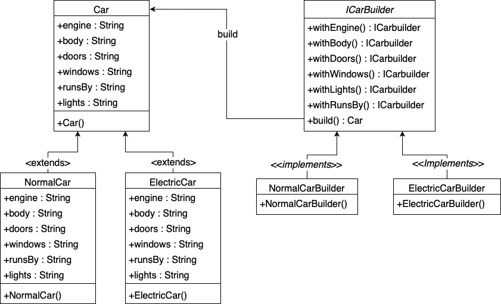

# Builder pattern example using Test Driven Development

## Example (Car):

* There are two different types of cars.
* Normal cars and Electric cars should be created with the builders.
* Electric car builder would create electric car from it.
* Normal car builder would create normal car.
* Since, the state of the car is so long and client cannot remember everything and their order.
* So the client uses these builders to a car from parameters which he remembers.

 

### code [electric car](https://github.com/shaikrasheed99/builder-pattern/tree/master/src/main/java/com/tw)

### code [normal car](https://github.com/shaikrasheed99/builder-pattern/tree/master/src/main/java/com/tw)

 

## Class diagram: 

